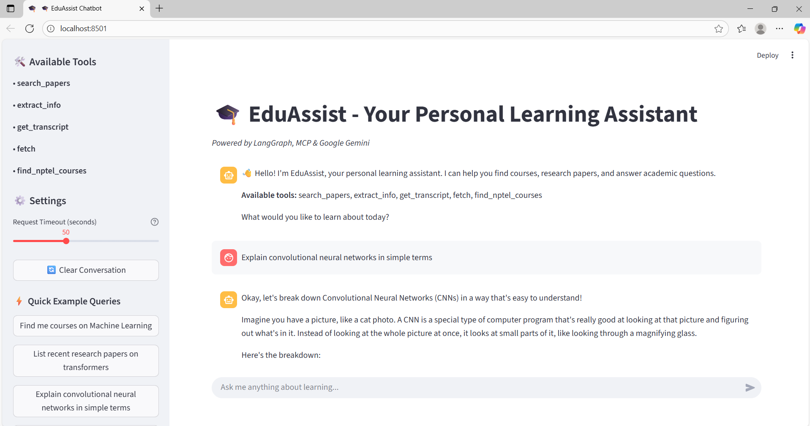

# 🎓 EduAssist — AI-Powered Research & Learning Assistant

[](https://python.org)
[](https://streamlit.io)
[](https://langchain-ai.github.io/langgraph/)
[](LICENSE)

**An intelligent research companion that combines LangGraph agents, MCP tools, and advanced AI to accelerate academic research workflows and student learning.**

EduAssist bridges the gap between fragmented research tools by providing a unified platform for academic paper discovery, content analysis, course recommendations, and intelligent Q&A — all powered by memory-enabled conversation that adapts to your research focus.



## 📋 Table of Contents

- [🔬 Features](#-features)
- [🏗️ Architecture](#️-architecture)  
- [🚀 Quick Start](#-quick-start)
- [⚙️ Configuration](#️-configuration)
- [🛠️ Usage](#️-usage)
- [📊 Research Capabilities](#-research-capabilities)
- [🤝 Contributing](#-contributing)
- [📄 License](#-license)
- [❓ FAQ](#-faq)

## 🔬 Features

### **Academic Research Tools**
- **arXiv Paper Discovery**: Search, extract, and analyze academic papers with automatic metadata storage
- **Citation Management**: Organize research papers with JSON metadata for easy reference
- **Paper Summarization**: AI-powered extraction of key insights, methodologies, and findings

### **Multi-Modal Content Analysis**
- **YouTube Transcript Extraction**: Process educational videos and lectures for research analysis
- **Web Research Integration**: Fetch and analyze academic websites and documentation
- **NPTEL Course Discovery**: Semantic search through pre-embedded course datasets

### **Intelligent Memory System**
- **Persistent Context**: Remember research topics and ongoing investigations across sessions
- **Adaptive Learning**: Personalize recommendations based on research history
- **Cross-Reference Tracking**: Maintain connections between papers, concepts, and research threads

## 🏗️ Architecture

EduAssist/<br>
├── Config/<br>
│ └── .env   # Environment variables and API keys<br>
├── Data/<br>
│ └── nptel_courses_with_embeddings.xlsx<br>
├── agent_orchestrator.py   # LangGraph ReAct agent with memory<br>
├── course_retriever.py # NPTEL semantic search engine<br>
├── main.py # Streamlit research interface<br>
├── research_mcp.py # arXiv paper discovery & extraction<br>
├── youtube_mcp.py # Academic video transcript extraction<br>
├── requirements.txt # Python dependencies<br>
└── README.md # Project documentation<br>


### **Core Components**
- **Memory-Enabled Agent**: LangGraph ReAct agent with MemorySaver for persistent research context
- **MCP Integration**: Model Context Protocol servers for seamless tool communication
- **Semantic Search Engine**: SentenceTransformer-based recommendations with cosine similarity
- **Interactive UI**: Streamlit interface with real-time processing and debug capabilities

## 🚀 Quick Start

### **Prerequisites**

Before you begin, ensure you have the following installed:
- Python 3.8 or higher
- pip package manager
- Git

### **Installation**

1. **Clone the repository**
```bash
git clone https://github.com/zeeshanparwez/EduAssist.git
cd EduAssist
````

2. **Install dependencies**
```bash
pip install -r requirements.txt
````


3. **Install uv for MCP server management**
```bash
curl -LsSf https://astral.sh/uv/install.sh | sh
````

### **Configuration**

1. **Create environment file**
```bash
mkdir Config
touch Config/.env
````

2. **Add your API credentials to `Config/.env`**
```bash
GOOGLE_API_KEY=your_google_generative_ai_key_here
COURSE_DATA_PATH=/absolute/path/to/nptel_courses.xlsx
````

3. **Prepare course data** (Optional)
- Download or prepare NPTEL course dataset with pre-computed embeddings
- Ensure Excel file contains: `embedding`, `course_name`, `url`, `description` columns [attached_file:4]

### **Launch Application**
```bash
streamlit run main.py
````

The application will be available at `http://localhost:8501`

## ⚙️ Configuration

### **Environment Variables**

| Variable | Description | Required |
|----------|-------------|----------|
| `GOOGLE_API_KEY` | Google Generative AI API key for Gemini model | ✅ Yes |
| `COURSE_DATA_PATH` | Absolute path to NPTEL courses Excel file | ✅ Yes |

### **Course Dataset Format**

Your NPTEL course dataset should include these columns:
- `embedding`: Pre-computed sentence embeddings (JSON array format)
- `course_name`: Course title for display
- `url`: Direct course link  
- `description`: Course summary for semantic matching

## 🛠️ Usage

### **Starting a Research Session**

1. Launch the application using `streamlit run main.py`
2. Wait for initialization to complete (tools will appear in sidebar)
3. Start asking research questions in natural language

### **Research Workflow Examples**

**Paper Discovery**:
"Find recent papers on neural networks for natural language processing"

**Course Recommendations**:
"Suggest NPTEL courses related to machine learning and AI"

**Video Analysis**:
"Extract transcript from this YouTube lecture: [URL]"

**Multi-Modal Research**:
"Research transformer architectures, find papers and related courses"

## 📊 Research Capabilities

### **Academic Paper Management**
- **Automated Search**: Query arXiv database with natural language
- **Metadata Extraction**: Automatic paper information parsing and storage
- **Citation Tracking**: Organize research with JSON-based reference system

### **Content Analysis Pipeline**
- **Educational Video Processing**: Extract and analyze YouTube lecture content
- **Web Research Tools**: Fetch academic websites and documentation
- **Course Discovery**: Find relevant educational content using semantic similarity 

### **Memory-Enhanced Learning**
- **Session Persistence**: Maintain research context across multiple interactions
- **Adaptive Recommendations**: Learn from research patterns and preferences 
- **Knowledge Graph**: Build connections between papers, concepts, and resources 

## 🤝 Contributing

We welcome contributions from the research community! Here's how you can help:

### **Development Setup**

1. Fork the repository
2. Create a feature branch: `git checkout -b feature-name`
3. Make your changes and test thoroughly
4. Submit a pull request with detailed description

### **Areas for Contribution**
- Enhanced citation network analysis
- Multi-language academic content support
- Advanced research visualization tools
- Integration with institutional repositories

### **Code Style**
- Follow PEP 8 Python style guidelines
- Add docstrings to all functions and classes
- Include unit tests for new features
- Update documentation as needed

## 📄 License

This project is licensed under the MIT License - see the [LICENSE](LICENSE) file for details.

## ❓ FAQ

### **General Questions**

**Q: What makes EduAssist different from other research tools?**<br>
A: EduAssist combines multiple research workflows into a single memory-enabled AI assistant, providing contextual recommendations and maintaining research continuity across sessions.

**Q: Do I need programming knowledge to use EduAssist?**<br>
A: No! EduAssist provides a user-friendly Streamlit interface that requires no programming experience.

### **Technical Questions**

**Q: How does the memory system work?**<br>
A: EduAssist uses LangGraph's MemorySaver to maintain conversation context and research history across sessions.

**Q: Can I add custom research sources?**<br>
A: Yes, the MCP architecture allows for easy integration of additional research tools and databases.

**Q: What if initialization fails?**<br>
A: Check your API keys, network connection, and use the built-in Retry button in the interface. Debug logs are available in the sidebar.

### **Data and Privacy**

**Q: How is my research data stored?**<br>
A: Research data is stored locally in JSON format. No personal research information is sent to external services beyond necessary API calls.

**Q: Is my conversation history private?**<br>
A: Yes, all conversation memory is stored locally using LangGraph's MemorySaver system.

---

**Transform your research workflow with AI-powered discovery, analysis, and synthesis. Start exploring the future of academic research today!**

For questions and support, please [open an issue](https://github.com/zeeshanparwez/EduAssist/issues) or contact the development team.

