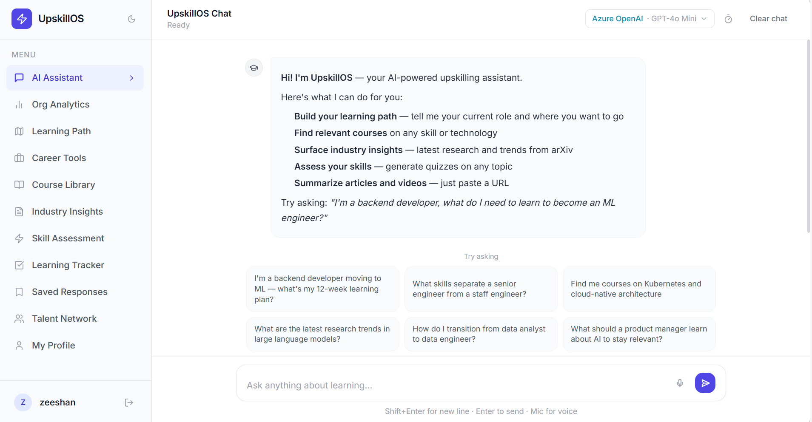
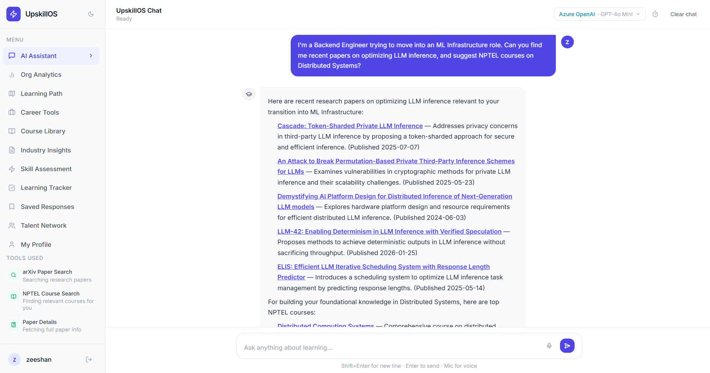
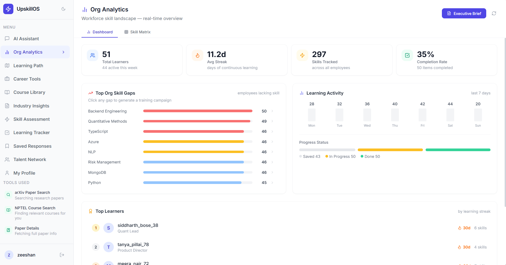
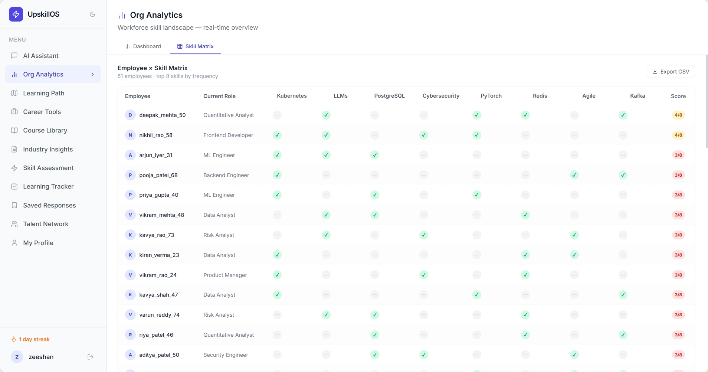
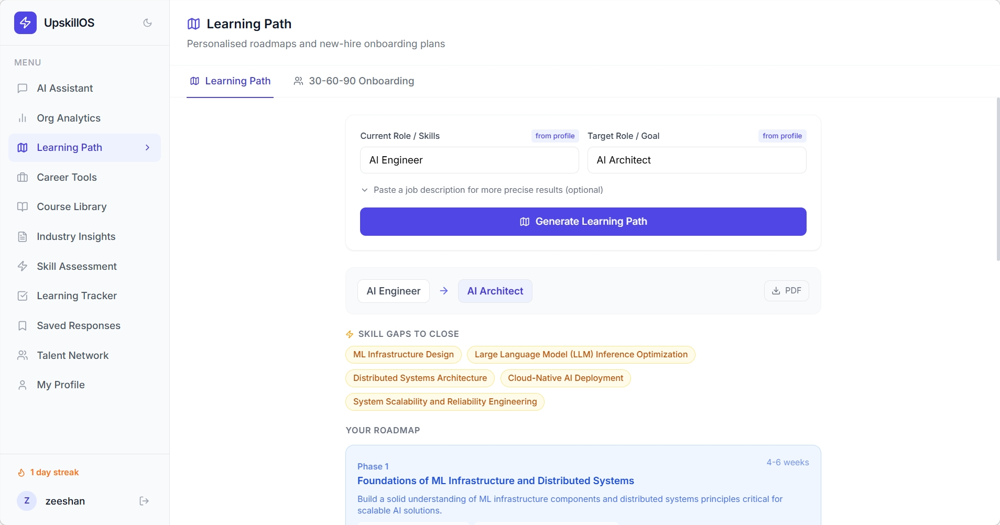
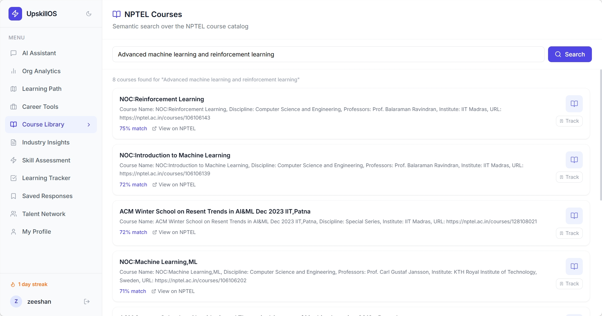
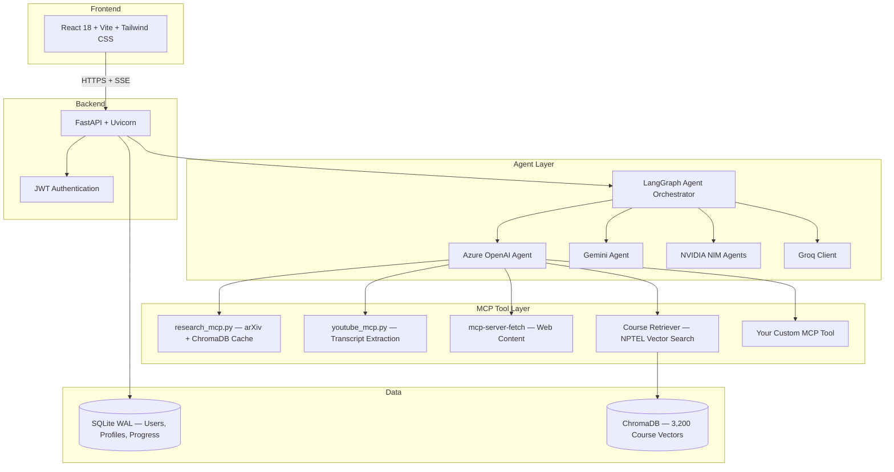

<div align="center">
  
  
  
  
  
  
  
</div>

<br/>

<div align="center">
  <h1>UpskillOS</h1>
  <p><strong>AI-Powered Continuous Learning & Talent Intelligence Platform</strong></p>
  <p>From personal upskilling engine → organisational talent intelligence layer</p>
  
</div>

<br/>

**UpskillOS** is a multi-agent AI platform that transforms how professionals learn and how organisations understand their talent. It started as a personal tool for an AI engineer who needed to stay current — and evolved into a full organisational intelligence system.

Unlike traditional LMS platforms that track completions, UpskillOS uses **behavioural data** — what people actually search, ask, and study — to build living skill profiles, identify org-wide capability gaps, and generate executive-ready talent briefs. All powered by a multi-agent architecture where each LLM provider operates as an independent agent with access to real-time research tools via the **Model Context Protocol (MCP)**.

---

## What Makes This Different

| Traditional LMS | UpskillOS |
|---|---|
| Tracks course completions | Extracts skills from actual learning behaviour |
| Static skill matrices from self-reporting | Living profiles that update after every session |
| Annual surveys for org insights | Real-time dashboards from aggregated behaviour |
| Generic course catalogues | AI agent that reasons, searches, and builds curricula |
| Single LLM or no AI | Multi-agent system with 7 LLM providers and cascading fallback |

---

## Core Capabilities

### 1. Multi-Agent AI Assistant with MCP Tool Integration

This is not a single-model chatbot wrapper. UpskillOS runs a **multi-agent architecture** where each LLM provider (Azure OpenAI, Gemini, NVIDIA NIM, Groq, DeepSeek, QwQ) is registered as an independent **LangGraph ReAct agent** with full access to a shared tool layer.

The tool layer is built entirely on the **Model Context Protocol (MCP)** — the open standard for connecting LLMs to external data sources. Each tool runs as a separate MCP server subprocess, communicating over stdio transport. The agent reasons about which tools to invoke, executes them (sometimes in parallel), and synthesises the results into a structured response — all streamed token-by-token via SSE.

**Built-in MCP Tools:**

| Tool | MCP Server | What It Does |
|---|---|---|
| `search_papers` | `research_mcp.py` (FastMCP) | Searches arXiv and caches results in an in-session ChromaDB vector store |
| `extract_info` | `research_mcp.py` (FastMCP) | Retrieves full metadata for a specific arXiv paper |
| `search_cached_papers` | `research_mcp.py` (FastMCP) | Semantic search across all papers fetched in the current session |
| `get_transcript` | `youtube_mcp.py` (FastMCP) | Extracts full transcripts from YouTube videos |
| `fetch` | `mcp-server-fetch` (uvx) | Retrieves and processes content from any web URL |
| `find_nptel_courses` | LangChain Tool | Semantic vector search across 3,200+ NPTEL courses (ChromaDB, 768d embeddings) |

**Extensible by design** — you can add your own MCP tools by dropping a new FastMCP server script into `backend/mcp/` and registering it in `agent_orchestrator.py`. The agent will automatically discover and use the new tools. Any tool that speaks the MCP protocol (stdio or SSE transport) plugs in directly.

<div align="center">
  
  <p><em>The sidebar shows MCP tools firing in real-time as the agent reasons through a career transition query</em></p>
</div>

### 2. Org Analytics & Workforce Intelligence

Every interaction on the platform generates behavioural data. That data is aggregated into an **org-level intelligence dashboard** designed for CHROs and Talent Development leaders — no surveys, no forms, no self-reporting.

- **Skill Gap Heatmap** — which capabilities are critically thin across the organisation
- **Learning Velocity** — average streak, active learners, completion rates
- **AI Executive Brief** — one-click generation of a board-ready workforce intelligence report (org health score, risk areas, priority actions with 30/60/90-day timelines)
- **Gap Training Campaigns** — click any skill gap → get a structured multi-week training plan with objectives, resources, and success metrics

<div align="center">
  
  <p><em>Real-time workforce metrics derived entirely from learning behaviour — not surveys</em></p>
</div>

### 3. Employee × Skill Matrix

A dense, real-time view of every employee mapped against the organisation's top skills. Green means developing. Missing means gap. Click any gap to generate a targeted training campaign.

Derived from actual learning behaviour, not annual self-assessments. The matrix updates as people learn.

<div align="center">
  
  <p><em>51 employees × top 8 skills — each cell computed from behavioural profile extraction</em></p>
</div>

### 4. Career Intelligence & Learning Path Generation

Map the journey from **Current Role → Target Role** with a structured, phased learning plan. The engine analyses the skill delta, identifies the gaps, and maps specific NPTEL courses and resources to each phase — generated in seconds, not weeks.

Also includes: **Onboarding Planner** (role + department → 30-day structured plan), **Career Readiness Score**, and **JD Analyser** (paste a job description → get a gap analysis against your profile).

<div align="center">
  
  <p><em>AI Engineer → ML Infrastructure — structured weekly plan with mapped courses</em></p>
</div>

### 5. Semantic Course & Research Discovery

Vector search across 3,200+ NPTEL courses using Gemini embeddings (768 dimensions) stored in ChromaDB. Search by concept, not keyword — "distributed consensus algorithms" finds courses on Paxos, Raft, and Byzantine fault tolerance even if those exact words aren't in the title.

Live arXiv integration surfaces today's papers, not a cached database.

<div align="center">
  
  <p><em>Semantic similarity scores show how closely each course matches the query intent</em></p>
</div>

### 6. Behavioural Profile Extraction

Every conversation is silently analysed by the LLM. Skills and interests are extracted from **what users do** — not what they claim on a form. The profile updates itself after every session.

This is the foundation of everything else. The skill matrix, the org analytics, the talent network — all built on top of these auto-extracted profiles.

### 7. Additional Capabilities

| Feature | Description |
|---|---|
| **Skill Assessment** | AI-generated MCQs on any topic — fresh questions every attempt, no question bank |
| **Learning Tracker** | Progress tracking with daily streak — measures consistency, not just completions |
| **Talent Network** | Semantic skill matching to discover mentors, collaborators, and complementary expertise |
| **Saved Responses** | Bookmark any AI response to build a personal knowledge base |
| **Pomodoro Timer** | Built-in focus sessions for structured learning |
| **Career Tools** | JD analyser, resume parser, cover letter generator, playlist study guide |

---

## Architecture

### Multi-Agent LLM Routing

UpskillOS doesn't depend on a single LLM. It maintains **multiple independent agents**, each backed by a different provider, with automatic cascading fallback:

```
Azure OpenAI (GPT-4o Mini)     ← Primary agent (tool-capable, LangGraph ReAct)
  ↓ fallback
Google Gemini (3.1 Flash Lite)  ← Secondary agent (tool-capable, LangGraph ReAct)
  ↓ fallback
NVIDIA NIM (Llama 3.3 70B)     ← Tertiary agent (tool-capable, LangGraph ReAct)
NVIDIA NIM (Llama 4 Maverick)  ← Tool-capable agent
NVIDIA NIM (DeepSeek R1)       ← Reasoning model (chat-only, no tools)
NVIDIA NIM (QwQ 32B)           ← Reasoning model (chat-only, no tools)
Groq (GPT-OSS 120B)           ← Fast inference (chat-only, no tools)
```

Every tool-capable agent has access to the full MCP tool layer. Users can switch between providers in the UI. The system gracefully degrades — if Azure is down, it falls through to Gemini, then NIM.

### System Architecture


```mermaid
graph TD
    subgraph Frontend
        UI[React 18 + Vite + Tailwind CSS]
    end

    subgraph Backend
        API[FastAPI + Uvicorn]
        AUTH[JWT Authentication]
    end

    subgraph Agent Layer
        ORCH[LangGraph Agent Orchestrator]
        AZURE[Azure OpenAI Agent]
        GEMINI[Gemini Agent]
        NIM[NVIDIA NIM Agents]
        GROQ[Groq Client]
    end

    subgraph MCP Tool Layer
        MCP1[research_mcp.py — arXiv + ChromaDB Cache]
        MCP2[youtube_mcp.py — Transcript Extraction]
        MCP3[mcp-server-fetch — Web Content]
        MCP4[Course Retriever — NPTEL Vector Search]
        MCP5[Your Custom MCP Tool]
    end

    subgraph Data
        DB[(SQLite WAL — Users, Profiles, Progress)]
        VEC[(ChromaDB — 3,200 Course Vectors)]
    end

    UI -->|HTTPS + SSE| API
    API --> AUTH
    API --> ORCH
    ORCH --> AZURE
    ORCH --> GEMINI
    ORCH --> NIM
    ORCH --> GROQ
    AZURE --> MCP1
    AZURE --> MCP2
    AZURE --> MCP3
    AZURE --> MCP4
    AZURE --> MCP5
    API --> DB
    MCP4 --> VEC
```

### Adding Your Own MCP Tools

The tool layer is fully extensible. To add a new MCP tool:

**1. Create a FastMCP server** in `backend/mcp/`:

```python
# backend/mcp/my_tool.py
# /// script
# dependencies = ["fastmcp", "mcp"]
# ///
from mcp.server.fastmcp import FastMCP

mcp = FastMCP("my_tool")

@mcp.tool()
def my_custom_search(query: str) -> str:
    """Search your internal knowledge base."""
    # Your logic here
    return results

if __name__ == "__main__":
    mcp.run(transport="stdio")
```

**2. Register it** in `backend/agent_orchestrator.py`:

```python
server_configs = [
    ("research", StdioServerParameters(command=_uv, args=["run", "backend/mcp/research_mcp.py"])),
    ("youtube",  StdioServerParameters(command=_uv, args=["run", "backend/mcp/youtube_mcp.py"])),
    ("fetch",    StdioServerParameters(command=_uvx, args=["mcp-server-fetch"])),
    ("my_tool",  StdioServerParameters(command=_uv, args=["run", "backend/mcp/my_tool.py"])),  # ← add this
]
```

That's it. The agent orchestrator auto-discovers all tools from each MCP server at startup. Every agent (Azure, Gemini, NIM) will immediately have access to your new tool.

---

## Project Structure

```
ScholarGen/
├── backend/
│   ├── main.py                         # FastAPI app, lifespan, CORS, router registration
│   ├── agent_orchestrator.py           # MCP session manager — launches tool subprocesses
│   ├── jwt_utils.py                    # JWT token creation and verification
│   ├── dependencies.py                 # FastAPI auth dependency
│   ├── services/
│   │   └── chatbot_service.py          # Multi-agent orchestration, SSE streaming
│   ├── routers/
│   │   ├── auth.py                     # POST /register, POST /login
│   │   ├── chat.py                     # POST /stream (SSE), DELETE /clear
│   │   ├── courses.py                  # GET /search — NPTEL semantic search
│   │   ├── papers.py                   # GET /search — arXiv paper search
│   │   ├── flashcards.py              # POST /generate — AI MCQ generation
│   │   ├── collaborate.py             # GET / — semantic user matching
│   │   ├── learningpath.py            # POST /generate — role-to-role curriculum
│   │   ├── profile.py                 # GET/PUT — behavioural profile management
│   │   ├── career.py                  # POST /analyze, /readiness, /onboarding
│   │   ├── analytics.py              # GET /, /skill-matrix, POST /brief, /gap-plan
│   │   ├── bookmarks.py              # GET/POST/DELETE — saved responses
│   │   └── progress.py               # GET/POST/PUT/DELETE — learning tracker
│   ├── core/
│   │   ├── database.py                # SQLite WAL — schema, queries, analytics aggregation
│   │   ├── azure_llm.py              # Azure OpenAI helper (SDK + LangChain wrapper)
│   │   ├── course_retriever.py       # ChromaDB loader + LangChain tool wrapper
│   │   ├── collaboration.py          # Profile extraction + cosine similarity matching
│   │   ├── flashcards.py             # MCQ generation with multi-LLM fallback
│   │   └── key_manager.py            # API key rotation for Gemini
│   └── mcp/
│       ├── research_mcp.py            # FastMCP — arXiv search + in-session paper cache
│       └── youtube_mcp.py             # FastMCP — YouTube transcript extraction
├── frontend/
│   ├── src/
│   │   ├── api.js                     # API client with SSE streaming parser
│   │   ├── pages/
│   │   │   ├── LoginPage.jsx          # Authentication UI
│   │   │   └── ChatPage.jsx           # Main app shell — 11 feature panels
│   │   └── components/
│   │       ├── Sidebar.jsx            # Navigation + active tool indicators
│   │       ├── ChatInput.jsx          # Message input with voice support
│   │       ├── ChatMessage.jsx        # Markdown rendering with syntax highlighting
│   │       ├── AnalyticsPanel.jsx     # Org dashboard + skill matrix + executive brief
│   │       ├── LearningPathPanel.jsx  # Career path generator
│   │       ├── CareerPanel.jsx        # JD analyser, readiness score, onboarding
│   │       ├── CoursesPanel.jsx       # NPTEL semantic search
│   │       ├── PapersPanel.jsx        # arXiv paper discovery
│   │       ├── FlashcardModal.jsx     # AI skill assessment
│   │       ├── CollaboratePanel.jsx   # Talent network
│   │       ├── ProfilePanel.jsx       # User profile with auto-extracted skills
│   │       ├── ProgressPanel.jsx      # Learning tracker + streak
│   │       ├── BookmarksPanel.jsx     # Saved AI responses
│   │       ├── PomodoroTimer.jsx      # Focus timer
│   │       └── OnboardingModal.jsx    # First-run profile setup
│   └── dist/                          # Production build — served by FastAPI
├── Config/
│   ├── .env                           # API keys and secrets (gitignored)
│   └── .env.example                   # Template with all required variables
├── Data/
│   ├── nptel_courses_with_embeddings.xlsx  # Pre-embedded NPTEL catalogue
│   └── scholargen.db                       # SQLite database (auto-created)
├── scripts/
│   └── generate_embeddings.py         # Re-embed NPTEL catalogue with Gemini API
├── images/                            # Screenshots for documentation
├── requirements.txt
└── LICENSE
```

---

## Quick Start

### Prerequisites

- **Python 3.11+**
- **Node.js 18+**
- **[uv](https://docs.astral.sh/uv/)** — required for MCP server subprocess management

```bash
curl -LsSf https://astral.sh/uv/install.sh | sh
```

### 1. Clone & Install

```bash
git clone https://github.com/zeeshanparwez/ScholarGen.git
cd ScholarGen
pip install -r requirements.txt
```

### 2. Configure Environment

```bash
cp Config/.env.example Config/.env
```

Edit `Config/.env` with your API keys. At minimum, you need one LLM provider and a JWT secret. Azure OpenAI is recommended as the primary provider for production use.

See [`.env.example`](Config/.env.example) for all available configuration variables.

### 3. Build the Frontend

```bash
cd frontend
npm install
npm run build
cd ..
```

### 4. Run

```bash
uvicorn backend.main:app --host 0.0.0.0 --port 3256
```

Open [http://localhost:3256](http://localhost:3256). Create an account and start using the platform.

### Development Mode

Run backend and frontend separately with hot reloading:

```bash
# Terminal 1 — Backend (auto-reloads on Python changes)
uvicorn backend.main:app --reload --port 3256

# Terminal 2 — Frontend (Vite dev server, proxies /api → backend)
cd frontend && npm run dev
```

---

## SSE Streaming Protocol

`POST /api/chat/stream` returns `text/event-stream` with the following event types:

```
data: {"type": "token",     "content": "Hello"}           # Streamed token
data: {"type": "tool_call", "tool": "search_papers", "status": "start"}  # Tool invocation started
data: {"type": "tool_call", "tool": "search_papers", "status": "end"}    # Tool invocation completed
data: {"type": "done"}                                     # Stream complete
data: {"type": "error",     "content": "..."}              # Error occurred
```

The frontend renders tool status in real-time — users see exactly which MCP tools the agent is invoking as it reasons through their query.

---

## Tech Stack

| Layer | Technology |
|---|---|
| **Frontend** | React 18, Vite 5, Tailwind CSS 3 |
| **Backend** | FastAPI 0.115, Uvicorn, Python 3.11 |
| **Agent Framework** | LangGraph 0.6.7, LangChain 0.3 |
| **LLM Providers** | Azure OpenAI, Google Gemini, NVIDIA NIM, Groq |
| **Tool Protocol** | Model Context Protocol (MCP) via FastMCP + mcp-server-fetch |
| **Vector Store** | ChromaDB 0.6 (in-memory, 768d Gemini embeddings) |
| **Database** | SQLite with WAL mode |
| **Authentication** | JWT (PyJWT 2.9) + bcrypt |
| **Embeddings** | Gemini Embedding API (gemini-embedding-2-preview) |

---

## Configuration

| Variable | Description | Required |
|---|---|---|
| `AZURE_OPENAI_API_KEY` | Azure OpenAI API key | Recommended |
| `AZURE_OPENAI_ENDPOINT` | Azure OpenAI endpoint URL | With Azure |
| `AZURE_OPENAI_DEPLOYMENT` | Azure deployment name | With Azure |
| `GOOGLE_API_KEY` | Google AI Studio key (Gemini + Embeddings) | Yes (for embeddings) |
| `NIM_API_KEY` | NVIDIA NIM API key | Optional |
| `GROQ_API_KEY` | Groq API key | Optional |
| `JWT_SECRET_KEY` | Secret for JWT token signing | Yes |
| `COURSE_DATA_PATH` | Path to NPTEL embeddings file | Auto-detected |
| `UV_PATH` / `UVX_PATH` | Path to uv/uvx binaries | Auto-detected |

At least one LLM provider must be configured. The system will use whatever is available and gracefully skip unconfigured providers.

---

## License

MIT License — see [LICENSE](LICENSE) for details.
