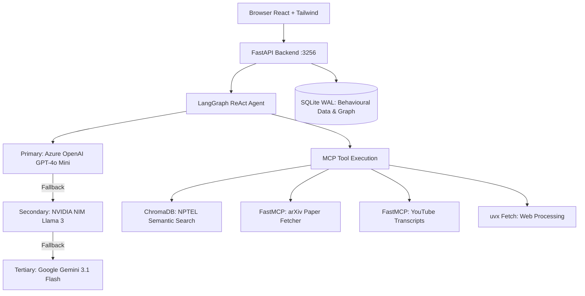

<div align="center">
  
  
  
  
  
</div>

<br/>

<div align="center">
  <h1>UpskillOS</h1>
  <p><strong>AI-Powered Continuous Learning & Talent Intelligence Platform</strong></p>
  
</div>

<br/>

**UpskillOS** (formerly ScholarGen) is an enterprise-grade capability-building platform. Designed originally as a personal knowledge system for AI engineers, it naturally scales into an **Organisational Intelligence System** for CHROs and Talent Development leaders, particularly in fast-paced Fintech and AI-first organizations.

It moves beyond passive learning management (LMS) by using live LLMs to dynamically extract behavioural skills, construct customized learning paths, and give leadership real-time visibility into the organization's capabilities via a highly dense Skill Matrix.

---

<br/>

## 🌟 The Core Capabilities

### 1. Organisational Analytics & Skill Heatmaps
Leadership visibility derived entirely from learning behavior—no manual surveys needed. As employees learn, the **Org Analytics Dashboard** instantly identifies critical skill gaps, average learning velocity, and tracks true capability across the workforce.

<div align="center">
  
</div>

### 2. Multi-Agent AI Research Assistant
Not a generic chatbot. The core LangGraph ReAct agent is tethered to **live tools** (NPTEL datasets, arXiv integration, YouTube transcripts, and web fetching). It reasons through queries and structures the optimal curriculum in real-time, completely visible to the user.

<div align="center">
  
</div>

### 3. Real-Time Talent Discovery
A dense snapshot of your internal capabilities. Discover mentors or project collaborators based on semantically matched skills extracted automatically during the learning process.

<div align="center">
  
</div>

### 4. Career Intelligence & Internal Mobility
Map out the leap from *Current Role* to *Target Role*. The engine generates an immediate, structured step-by-step curriculum utilizing semantic searches across internal or verified course catalogs (like NPTEL).

<div align="center">
  
</div>

### 5. Semantic Course & Research Discovery
The environment caches and queries high-density academic and training material seamlessly.

<div align="center">
  
</div>

---

<br/>

## 🏗️ Architecture

UpskillOS utilizes a cascading Fallback LLM Infrastructure guaranteeing maximum uptime.


```mermaid
graph TD
    UI[Browser React + Tailwind] --> API[FastAPI Backend :3256]
    
    API --> Agent[LangGraph ReAct Agent]
    
    Agent --> LLM1[Primary: Azure OpenAI GPT-4o Mini]
    LLM1 -- Fallback --> LLM2[Secondary: NVIDIA NIM Llama 3]
    LLM2 -- Fallback --> LLM3[Tertiary: Google Gemini 3.1 Flash]

    Agent --> MCP[MCP Tool Execution]
    
    MCP --> T1[ChromaDB: NPTEL Semantic Search]
    MCP --> T2[FastMCP: arXiv Paper Fetcher]
    MCP --> T3[FastMCP: YouTube Transcripts]
    MCP --> T4[uvx Fetch: Web Processing]
    
    API --> DB[(SQLite WAL: Behavioural Data & Graph)]
```

---

<br/>

## 🚀 Quick Start Guide

### Prerequisites
- **Python 3.11+**
- **Node.js 18+**
- **uv** (Package manager) — required for MCP servers: `curl -LsSf https://astral.sh/uv/install.sh | sh`

### 1. Clone & Install
```bash
git clone https://github.com/zeeshanparwez/ScholarGen.git
cd ScholarGen
pip install -r requirements.txt
```

### 2. Configure Environment
Copy the example config and inject your keys.
```bash
cp Config/.env.example Config/.env
```
_UpskillOS supports Azure OpenAI (Recommended primary), NVIDIA NIM, Groq, and Google Gemini as LLM routing layers._

### 3. Build the UI
```bash
cd frontend
npm install
npm run build 
cd ..
```

### 4. Start the Application
The backend automatically serves the built React app.
```bash
uvicorn backend.main:app --host 0.0.0.0 --port 3256
```
Open [http://localhost:3256](http://localhost:3256).

<br/>

### Development Mode (Hot Reloading)
For engineering extension, run distinct servers:
```bash
# Terminal 1 — FastAPI
uvicorn backend.main:app --reload --port 3256

# Terminal 2 — Vite Dev Server
cd frontend && npm run dev
```

---

<br/>

## 🔐 Database & Data Integrity
The backend strictly isolates the database state. 
The system utilizes a local **SQLite database configured with WAL (Write-Ahead Logging)** to safely aggregate progress markers, chat bookmarks, and structural profiles locally, without sending PII outside your server infrastructure.

> [!NOTE]
> For the CHRO Demonstration, you can optionally inject 50 high-density realistic profiles to populate the analytics dashboards to verify scaling:
> `python scripts/seed_50_users.py`

---

## 📜 License
MIT License. See [LICENSE](LICENSE) for details.
